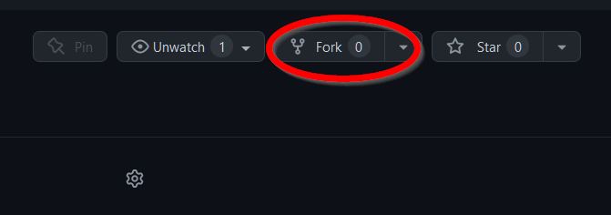
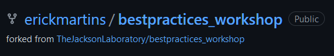
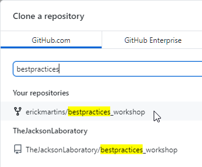
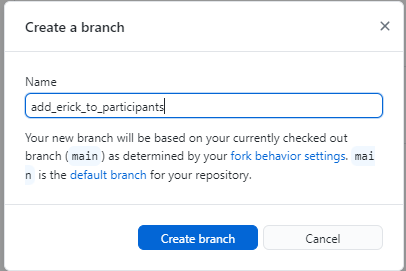
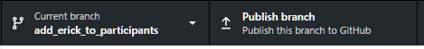
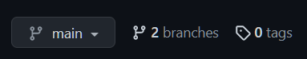
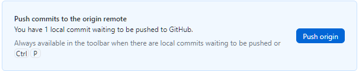
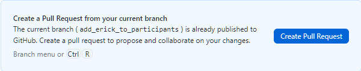

# Github workflow: branch-update-PR

1.  We are going to use **Github Desktop** for these tasks here. If you
    are comfortable with command-line git, feel free to use that
    instead.

2.  The first step is to go to the workshop repository and **fork** it.
    This will create a new repository under your user account that is a
    "mirror" of the original workshop repository.

    

3.  This way, you can work "locally" on your own repository, in your own
    branch, and when changes are ready to be submitted to the "gold
    standard" repository you can do that. Right now you should have
    something like this:
    
    

4.  The next step is to create a new *branch*. Branches are what they
    sound like: from a codebase, you can "branch" out to try something
    new, and when that is done you can *merge* the changes back to the
    main source code. Even when working on your own fork, it is a good
    idea to create a new branch for changes you are making.

5.  In this exercise, the only change we are going to make is adding
    your name to the list of participants on **README.md**. First off,
    we are going to clone your fork of the workshop repository to your
    computer. **If you had already cloned the workshop repository with
    Github Desktop, remove it and make sure to clone your fork.**

6.  Go to File -\> Clone repository... and then search for
    "bestpractices". You should see two of them: the original workshop
    repo belonging to *TheJacksonLaboratory* and your fork. Make sure to
    **clone your own fork**.
    
    

7.  You will be asked if you want to plan to use this fork "to
    contribute to the parent project" or "for my own purposes". This is
    largely what it sounds like: choosing the first one allows you to
    suggest changes to the parent repository, while the second one would
    change only your own version of it. Since we want to create a single
    list of all participants, choose **"to contribute to the parent
    project"**.

8.  You now have a local version of the repository on your computer to
    play with! You can have a look at it by going to Repository -\> Show
    in Explorer.

9.  Our next step is to create a *branch* where we will make the change
    to the list of participants. Go to Branch -\> New branch. Give it an
    informative name that describes what the change you'll be doing is
    and then click "create branch":
    
    

10. You now should see that your current branch is the one you just
    created. Right now, it only exists in your computer; to push the new
    branch to Github, click "Publish Branch":
    
    

11. If you go to your forked repository on the Github webpage, you can
    now see that you have two branches:
    
    

12. Now, we'll make the changes we want to make to our branch in our
    fork. Open **README.md** from the repository folder you have on your
    computer and add your name to the list of participants. After you
    save the file, you should see the list of changes on your Github
    Desktop window:
    
    

13. Now we'll commit these changes. Give the commit a good description
    that summarizes the change and click "commit to
    **YOURBRANCHNAMEHERE**".
    
    

14. This commit is still stored locally, so make sure to push it to the
    remote version of your repository hosted on github.
    
    

15. Github Desktop should now give you the option to create a pull
    request from your current branch. A pull request can be thought of
    as a "request to change"; you submit your proposed changes to the
    original repository, and the maintainers of that repository can
    choose whether to make them the new "standard" or not. Click "Create
    Pull Request".
    
    

16. This should open a browser window that will take you to the Github
    website. It will show you from which branch to which branch that
    pull request is being created (from your fork and your branch, to
    the original repository and "main" branch). Here, you have a chance
    to write a title and a description to your PR. It's a good idea to
    make them as descriptive as possible, to make it clear for the
    maintainers what exactly is being changed and why. In this case I
    will be pretty minimalistic, but you shouldn't!
    
    

17. You can see that you're taken to the main repository belonging to
    TheJacksonLaboratory, and there is now an open pull request. If you
    are not a repository maintainer, your work is more or less done at
    this point -- the maintainers will check your PR, and might request
    changes. When they are happy with those, they will merge your pull
    request, and it will become the new standard! If you are a
    maintainer, you might face the dreaded *merge conflicts* here --
    sometimes two versions of the same codebase cannot be seamlessly
    merged and you will need to solve the conflicts by picking which
    version should take precedence. We will NOT cover these here!
